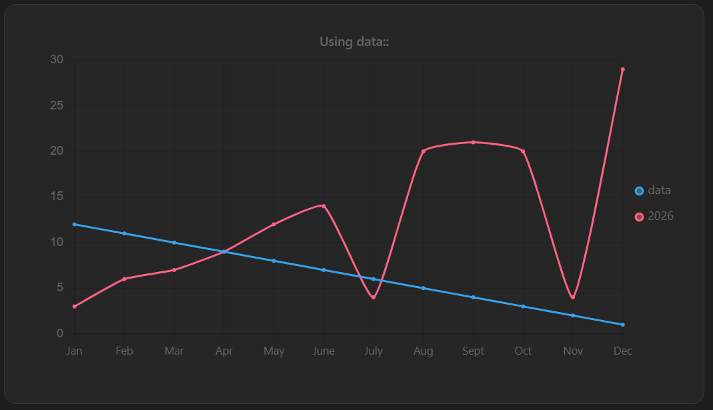
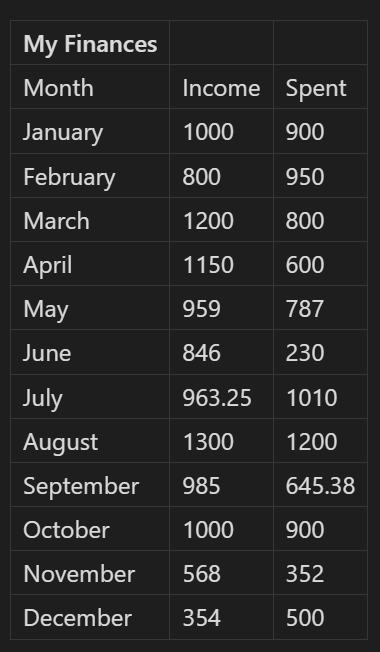
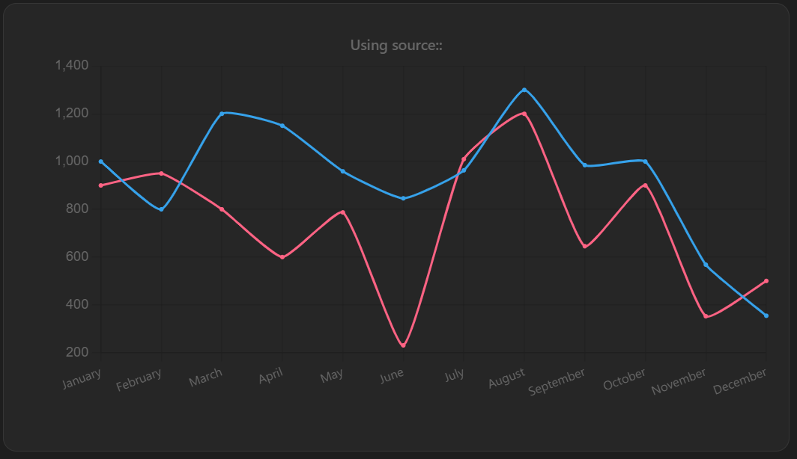
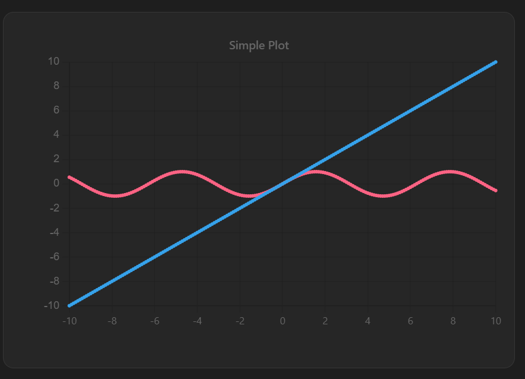
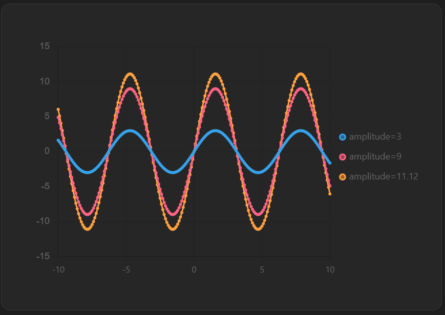

# DataCharts Plugin

DataCharts is an Obsidian plugin for creating charts, plotting functions, and visualizing note data directly in markdown.


## Features

  

- Currently supports line charts powered by Chart.js

- Uses Mathjs for parsing and plotting mathematical equations.

- Create plots with manually given data.

- Create plots with data stored in normal markdown tables.

- Customize datasets, plots, and canvas styling.

- Zoom, Pan, Inspect plot values.

  

## Usage

Currently the supported way to create a dataChart is by creating a codeblock with the title `lineplot`.
```
title^ is lineplot

// Some expression

```

## Examples

### Data Entry

The following example shows how to create a simple plot using the **data** keyword.

```lineplot

data:: [Month, Mood]
Month:: [ Jan, Feb, Mar, Apr, May, June, July, Aug, Sept, Oct, Nov, Dec]
Mood:: [12,11,10,9,8,7,6,5,4,3,2,1]

obj.scales.x.type = category
obj.plugins.legend.display = true

data(2026):: [Month, CrazyEvents]
CrazyEvents:: [3,6,7,9,12,14,4,20,21,20,4,29]

obj.plugins.title.text = Using data::
  
```

Generates the plot below. Notice that to name the data object you must use the  `data(name)` format. `obj.properties` are options you can modify per plot and belong to ChartJs options attributes. 



## Source from Tables 

Say you have a markdown table that looks something like this. 



You can generate a plot for this table like this. 

```lineplot
source(My Finances) :: table from Plugin Showcase
source(My Finances[Month,Spent]) :: table from Plugin Showcase


obj.scales.x.type = category
obj.plugins.title.text = Using source::
```

**Note:** Instead of column indexes you can also use the column names like so `source(My Finances[Month,Spent])`. The `source(name)` name field is required. *By default it will try to plot the first two columns.* 



## Plotting Equations

Plotting works by writing the mathematical equation with an = sign. It uses MathJs to parse the equations. Here's a basic example. 
```lineplot
y = x
f(x) = sin(x)

```

### Nested Functions

#### Scalar Values
You can declare a constant number to reuse in multiple equations as a variable. 
```lineplot

g(x) = ln(x)*G
f(x) = 0.5*G
G: 10

```

#### Lists of Values
You can declare a nested function as a list of variables to create multiple plots for one equation. 
```lineplot

y = sin(x)*amplitude
amplitude: [3,9,11.12]
obj.plugins.legend.display = true

```


#### Equations that depend on main variable
You can declare a nested function as a function that also depends on the main variable. I plan on adding support for declaring another range for a function.
```lineplot

f(x) = sin(x)*p
p: 11x

```
But this doesn't currently work since b isn't recognized. However you can still declare b as a constant. 
```lineplot

f(x) = sin(x)*p
p: b^2

```

## Modifying Properties

### Line Properties
You can specify the styling of each dataset using its name. Example. More properties can be found at  [Chart.js](https://www.chartjs.org/). 
```lineplot

somename = x + 1

somename.borderColor = yellow
somename.pointStyle = star

```

### Plot Properties
Any property that lives under ChartOptions in  [Chart.js](https://www.chartjs.org/)  can be modified per plot using the `obj` keyword. 
```lineplot
y(f) = 2f + 20

obj.plugins.title.text = Some Title
obj.scales.x.title.text = f Axis
obj.scales.y.title.text = y Axis

```

### Global Properties
Global properties will work on canvas/wrapper customization. For example you will be able to change the canvas height in pixels like `global.style.height = 400px`

Currently the only global property implemented is `global.xrange`.

#### xrange
**xrange** is a custom property that can be defined for each dataset. Using the example above `somename.xrange = [Start, End, Step]`.  You can also define a range for all datasets in a plot using `global.xrange`.

## Installation

Install from Community Plugins once published or
Manually place the plugin files in your vault's `.obsidian/plugins/datacharts` folder.
- main.js
- styles.css
- manifest.json

## Roadmap
- Improve stability from user feedback
- Query vault data through Bases / Datacore
- Add bar, scatter, pie, and other chart types.
- Expand equation parsing and custom math syntax


## Issues

Found a bug or have an idea? Open a GitHub Issue.